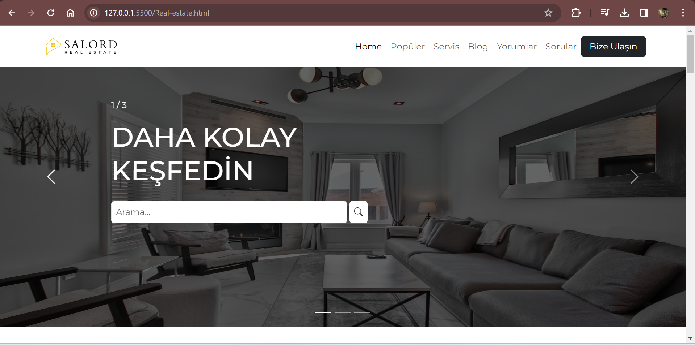
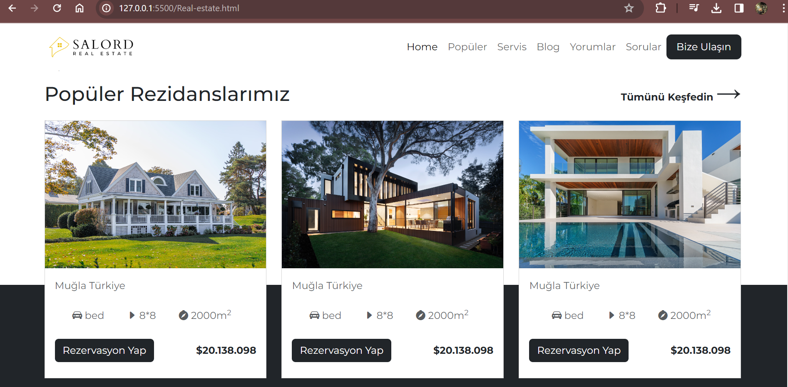

# Real Estate Website
This project is a real estate website designed to provide a visually appealing and user-friendly platform for showcasing property listings. Built with HTML and CSS, this static site features a clean layout and modern design, ideal for presenting real estate properties and their details.
# Used technologies
-HTML: For structuring the content and layout of the website
-CSS:For styling the website and ensuring a responsive, modern design
# Framework
- Bootstrap 
# Preview

# GIF

